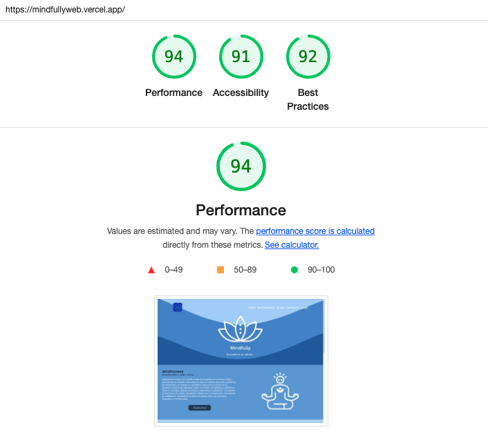

## Mindfully Web

# Project Overview
- This Project was developed with the intention of practicing HTML, CSS and JavaScript skills, also intended to incorporate UI Design and Mobile first design practices.
- Website could be a tool of knowledge for people interested in practicing Mindfulness and are not certain where to start.
- The website showcases a Testimonials section with experiences of other fellows Mindfulness practitioners with the intention to inspire another people.
- Section with guided meditations with audios hosted on soundcloud for practicality and with the intention of bringing easy access to these meditations.
- Blog Section with articles about Mindfulness to enhance the practice with facts based information.
- Designed the interface and started from a mobile first perspective. 

 # Project Requirements
 
 - The layout design was meticulously crafted using Figma, while HTML, CSS, and JavaScript were employed to implement and refine the layout.
 - Implemented soundcloud to host audios and embedded it on our website. 
 - Used Medium to post the articles and a SocialKit Widget to display the articles on the blog section. It would save development time.
 - The Login and the contact features will be developed on the second stage of this project.
 - Adding a functionality to add favorite meditations and create user profile to save blogs and favorite meditations, could be an interesting challenge.
 - The articles and information about Mindfulness were generated on ChatGPT, asking about general concepts about Mindfulness.
 - The guided Meditation script is a result of outputs generated on ChatGPT inspired on other guided meditations and my personal practice in Mindfulness.
 - The color scheme and layout were choosen on a palette that inspires calm and depth, also the imagery used is inspired on Meditation symbolism.

# Project Team 
- As this project was undertaken independently, I adhered to a self-determined timeline, commencing with the selection of a suitable color palette, curated imagery, and a meticulously crafted layout.
- You can reach out to me via the following channels [Twitter](https://twitter.com/jorgettor) and [Linkedin](https://www.linkedin.com/in/jorge-ttorres/)

# Project Plan 

- First step was doing a mockup on paper, and then choosing the color palette, proceeding to Figma to create wireframes.
- The performance test reached positive numbers.
<figure>

<figure-caption>Figure 2. Lighthouse Results</figure-caption>
</figure>

Quality assurance plan (e.g., testing, debugging, user acceptance)

# Project Launch [WIP]
Plan for launching the website, including marketing and promotion strategies
Plan for ongoing maintenance and updates to the website
Plan for measuring website performance and success

# Conclusion [WIP]
A website project documentation is a crucial document that outlines all aspects of the project from beginning to end. By including all necessary information, team members can have a clear understanding of the project goals, requirements, timeline, and responsibilities. This template can be customized based on the specific needs of the website project.

